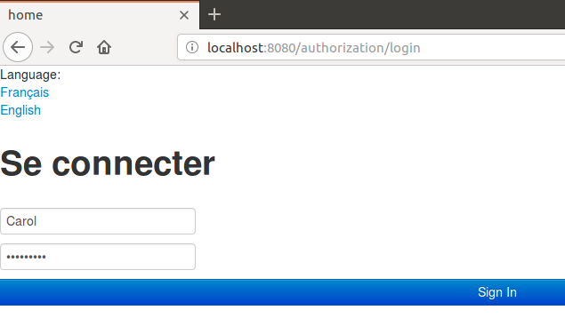
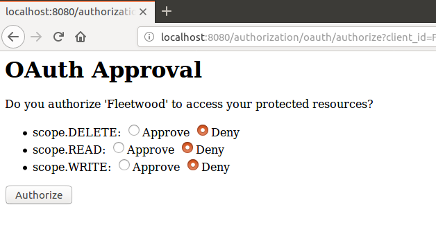

# sharewood-oauth2-user

I present here a different implementation of the previous project https://github.com/dubersfeld/sharewood-boot-oauth2-upgrade. It uses the same Spring Boot version 2.0.3.RELEASE. The main difference is the resource server implementation. Here I use RemoteTokenServices instead of sharing a token database between resource server and authorization server.

Here is the technology stack needed for running the complete application:

Any Linux platform (I use Ubuntu 16.04)

MySQL server installed

A recent Apache Maven version installed (I used 3.3.9)

In addition I used Spring Tool Suite for developing this demo but it is not required for running the application.

The complete application is comprised of an OAuth2 authorization server and an OAuth2 resource server. A standalone OAuth2 client is also used.

The authorization server and the resource server connect to two separate databases. All user passwords and client secret are explicitly stored as BCrypt hashes.

Project name         | Port | Database                 | Persists
---------------------|------|--------------------------|----------
authorization-server | 8080 | sharewood\_tokens\_users | token,users,client
sharewood            | 8081 | sharewood\_photos        | photos


Here are the steps to run the application.

## 1. Database creation

In MySQL client run the commands:
```
SOURCE sharewoodTokenUserDB.sql
SOURCE sharewoodPhotoDB.sql 
```

This creates the two databases named sharewood\_tokens\_users and sharewood\_photos.

## 2. JAR files creation

In each project directory:
1. authorization-server
1. sharewood
1. fleetwood

run the Maven command:
```
mvn clean package
```
 
## 3. Launching the application

In each project directory
1. authorization-server
1. sharewood
1. fleetwood

run the Maven command:
```
mvn spring-boot:run
```

Now you can login to the fleetwood client on port 9090. Once logged the user can execute all RESTful request after authenticating to the authorization server and granting to fleetwood the required scope.

The users server is populated with two users Alice and Carol who have the role USER. Their passwords are:
Alice: o8p7e6r5a
Carol: s1a2t3o4r

Now the user is presented the authentication page and approval page shown below:




The most tricky part of this project was to force the correct redirection after a successful login to authorization-server. This is achieved by subclassing the bean AuthenticationSuccessHandler and adding a custom RedirectFilter to the Spring Security filter chain in authorization-server.


